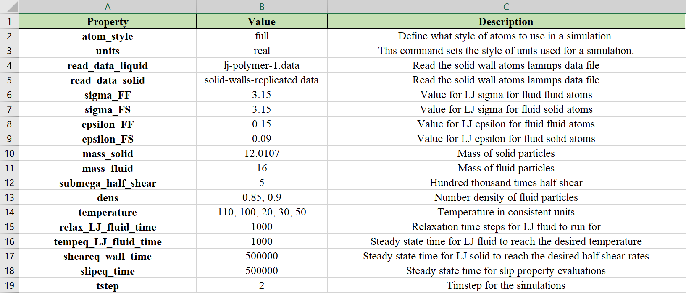

# Automatic Script Generator:
In computational research, it is often required to generate lots of scripts with different values for the same parameter in a parametric study or a high-throughput run. "Automatic Script Generator" provides an easy way to create these scripts by utilizing the "meshgrid" function from "numpy" library in python and reading the parameter values from an excel sheet to generate the required number of scripts.

## Installing the package:
To install run the following commands from a terminal on your system:
    
    git clone https://github.com/S22-06682/project-mhlbapat.git
    cd project-mhlbapat
    pip install src

## Using the package:
The installation of the package provides access to the function called "create_files.py" which takes in 3 arguments in the following order:
1. Path of the excel sheet which contains the parameter values. More information about creating a custom excel sheet is given in the section below.
2. Path of the base script which is to be replicated for specific parameter values in the excel sheet above. Information on building this base script is given in the later sections.
3. Results directory to store all the scripts generated from the package.

On the command line use the following command to generate required number of files:
    
    create_files.py <path to excel sheet> <path to base script> <path to results directory>

Remember to save the excel sheet everytime you make a change otherwise the package will simply generate scripts based on previously saved information about the excel sheet.

### Building the excel sheet:
Make an excel sheet such that:
- The first column contains the names of the variables you want to parametrize.
- The second column contains the values of the variables you want to loop over. If there are more than one values for a variable you can input them as comma separated values in column two.
- The third column is optional. It can be used to provide the description of the variable in column 1.
An example is provided in the snapshot below. The columns should have a column name in the first row as shown. The color coding is optional but recommended to make it organized.

### Building the base script file:
In the base script file which you want to replicate for the respective parameter values, replace the "variable value" with the string
"variable-name_valpy" instead of a number. For e.g. from the snapshot above, consider the "temperature" variable from cell A14, taking on the five values {110, 100, 20, 30, 50}. In the base script when you define "temperature" and set it to a number, set it to "temperature_valpy" string (without quotes) instead.
The package will generate all possible combinations of the variable values defined in the excel sheet. For e.g. if there are two variables in the excel sheet as shown in snapshot above taking on 2 and 5 values respectively, the package will generate 10 scripts with unique combination of "dens" and "temperature" in each script.

### Example:
There is an excel sheet inside the `data/excel-sheets/` folder of the package. The `data/lammps-files` contains a base script for the LAMMPS software used for molecular dynamics simulations. Although this example is for a LAMMPS script, the package can be used in a generic fashion for any script in any language which can be opened as plain text in python. Run the following command on the terminal from inside the `automatic_script_generator` directory:

    $ create_files.py data/excel-sheets/value-file-lammps-polymer.xlsm data/lammps-files/slip-flow-scratch.in results/
    Generating 10 folders. Looping over:  ['dens' 'temperature']

This will create 10 folders each containing a script with the unique combination of "dens" and "temperature" inside the folder `results/all_user_files`. If the directory `results/all_user_files` is already present, it will rename it to `results/all_user_files_<DATE-TIME>` and create a new directory `results/all_user_files` and store the generated scripts there. Within each folder, the package will create an excel sheet which shows the combination of variables for which the script in that folder was generated for.

## How the package works?
The package uses the "meshgrid" function from "numpy" library in python. Instead of explicity defining number of "for" loops for the given number of variables having two or more values to loop over, we create a meshgrid of the variables having multiple values. First we create a meshgrid which stores the positions of the values of the variables in their respective arrays. Then it loops over these values with a single "for" loop, accessing the values of variables with knowing their positions from the "ndenumerate" function.
